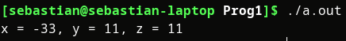
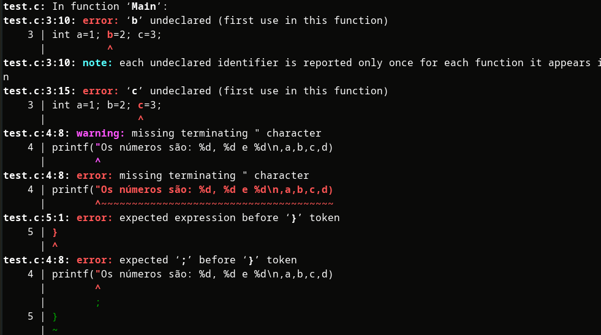
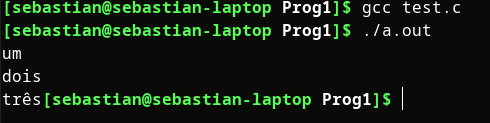
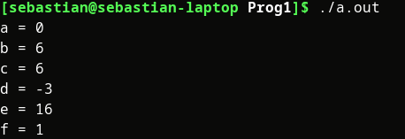
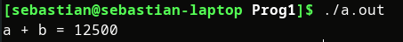

# <u>Lista de Exercícios 2:</u>

### Exercício 1

​	Resposta: O bloco 3 deveria ser A>B para não contemplar o caso de A==B e mandar aquele caso para o bloco 6. 


### Exercício 2

É um conjunto de instruções sequencial e finito que tem a finalidade de resolver algum problema.

### Exercício 3

$n = 0$
$while(n<4):$
$\quad read(nota1)$
$\quad read(nota2)$
$\quad read(nota3)$
$\quad media =(nota1+nota2+nota3)/3 $
$\quad print(media)$
$\quad if(media >= 5) \:then:$
$\quad \quad print(\text{"Parabéns, aprovado"})$
$\quad else:$
$\quad \quad print(\text{("Infelizmente, você foi reprovado")})$
$\quad n++$

O algoritmo tem um loop que acontece 4 vezes (1 vez por aluno) no qual pede 3 notas ao usuário, depois calcula a media (soma das notas dividido por 3) e se é maior ou igual a 5 mostra a mensagem "Parabéns, aprovado", senão mostra "Infelizmente, você foi reprovado".

### Exercício 4

$read(nomeUsuario)$
$read(idadeUsuario)$

$read(nomePaterno)$
$read(idadePaterno)$

$read(nomePaterna)$
$read(idadePaterna)$

$read(nomeMaterno)$
$read(idadeMaterno)$

$read(nomeMaterna)$
$read(idadeMaterna)$

$print(\text{"A diferença de idades com o teu avô paterno é: %d anos"}, idadePaterno - idadeUsuario)$
$print(\text{"A diferença de idades com a tua avó paterna é: %d anos"}, idadePaterno - idadeUsuario)$
$print(\text{"A diferença de idades com o teu avô materno é: %d anos"}, idadePaterno - idadeUsuario)$
$print(\text{"A diferença de idades com a tua  avó materna é: %d anos"}, idadePaterno - idadeUsuario)$

### Exercício 5

```c
#include <stdio.h>

int main(){
	int x,y,z;

	x = y = 10;
	z = x + 1;
	x = -x;
	y = y + 1;
	x = x + y - (z + 1) - 2 * y;

	printf("x = %d, y = %d, z = %d\n",x,y,z);

	return 0;
}
```



​	Resposta: e) x = -33, y = 11, z = 11

### Exercício 6

```c
#include <stdio.h>
int main(void){ //os () e {} estavam ao contrario
printf("Existem %d semanas no ano.", 56); //faltabam os "" para definir o string e faltaba o ; no final
return 1;//não havia espaço entre return e 1
}
```


### Exercício 7



```c
#include <stdio.h>
int main(void){
int a=1;
int b=2; 
int c=3;
printf("Os números são: %d, %d e %d\n",a,b,c);
}
```


### Exercício 8



### Exercício 9

**Variável: **Uma variável é uma estrutura que pode ser de diferentes tipos e é utilizada para armazenar dados.

### Exercício 10

**Constantes: ** As constantes são valores fixos, ou seja, não podem ser modificados.

Exemplos:

```c
#define MAX_SIZE 30

int main(){
    const int x = 10;
    printf("Constante");
    
    return 0;
}
```

Neste caso as constantes são MAX_SIZE, x e "Constante".

### Exercício 11

**Diferença: ** A constante não pode ser alterada pelo programa de nenhuma forma enquanto a variável representa um espaço onde podes guardar e modificar dados.

### Exercício 12

- [ ] 3ab
- [x] ab3
- [x] a3b
- [x] FIM
- [x] sim
- [ ] int
- [ ] \meu
- [x] A
- [ ] n a o
- [x] A123
- [ ] papel-branco
- [ ] a*
- [ ] c++
- [ ] *nova variavel

### Exercício 13

- [x]  int a;
- [x] float b;
- [ ] double float c;
- [x] unsigned char d;
- [ ] long float e;

### Exercício 14

```c
#include <stdio.h>
int main(void){
int x = 2, y = 4;
int a, b, c, d, e, f;
a = x & y;
b = x | y;
c = x ^ y;
d = ~x;
e = x << 3;
f = x >> 1;

printf("a = %d\nb = %d\nc = %d\nd = %d\ne = %d\nf = %d\n",a,b,c,d,e,f);
}
```



### Exercício 15



​											Resposta: 12500

### Exercício 16

```c
#include <stdio.h>
int main(void){
	int a,b;
	printf("Introduza o valor de a: ");
	scanf("%d",&a);
	printf("Introduza o valor de b: ");
	scanf("%d",&b);

	int aux;
	aux = a;
	a = b;
	b = aux;

	printf("O novo valor de a e: %d\n",a);
	printf("O novo valor de b e: %d\n",b);
	return 0;
}
```


### Exercício 17

```c
#include <stdio.h>
int main(void){
	int idade, paterno, materna, paterna, materno;

	printf("Introduza a sua idade: ");
	scanf("%d",&idade);
	printf("Introduza a idade do teu avô paterno: ");
	scanf("%d",&paterno);
	printf("Introduza a idade da tua avó paterna : ");
	scanf("%d",&paterna);
	printf("Introduza a idade do teu avô materno: ");
	scanf("%d",&materno);
	printf("Introduza a idade da tua avó materna : ");
	scanf("%d",&materna);

	printf("A diferença de idades com o teu avô paterno é: %d anos\n",paterno-idade);
	printf("A diferença de idades com a tua avó paterna é: %d anos\n",paterna-idade);
	printf("A diferença de idades com o teu avô materno é: %d anos\n",materno-idade);
	printf("A diferença de idades com a tua avó materna é: %d anos\n",materna-idade);
	return 0;
}
```

